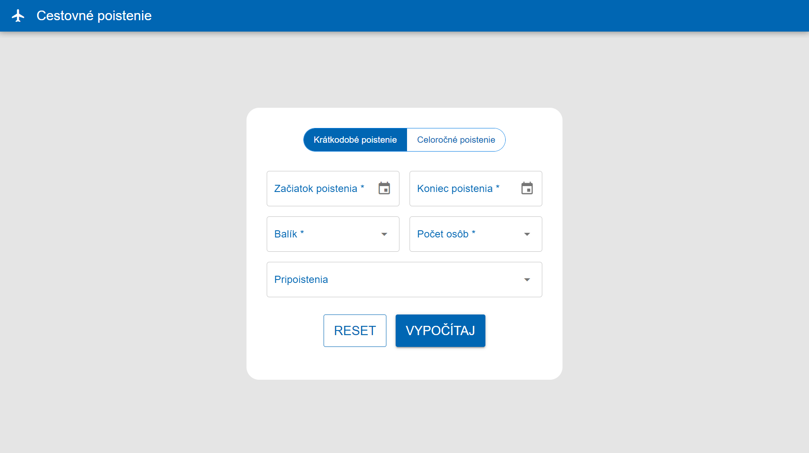
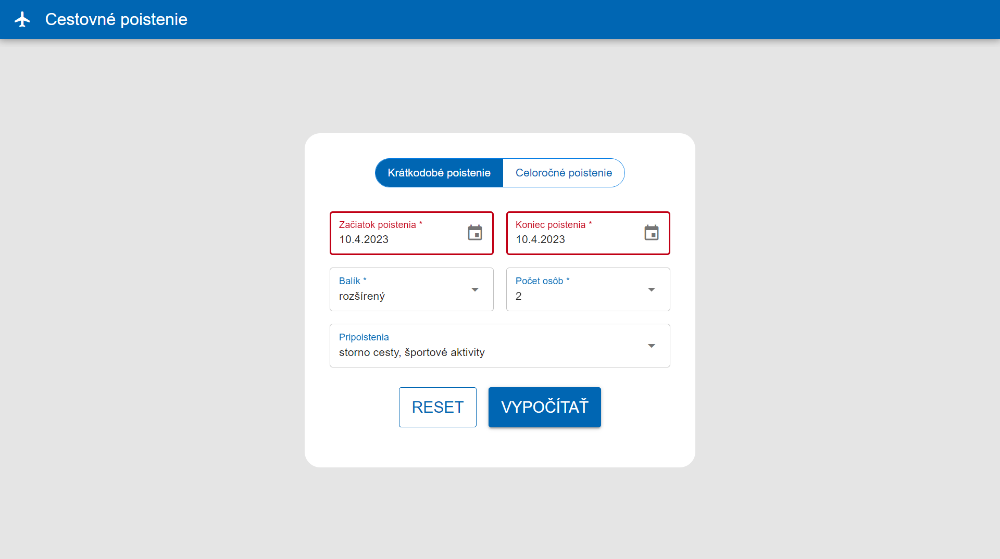
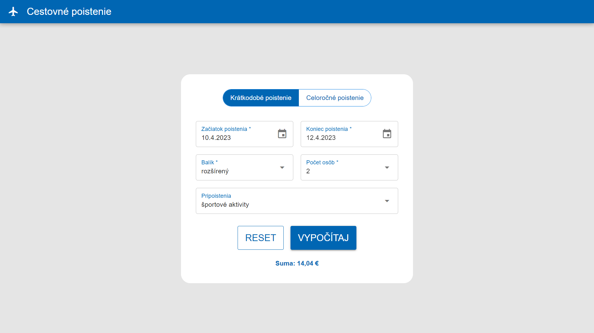

# Vue.js App (poistenie-vue)

[Live Demo](https://lemonrick.github.io/poistenie-vue/)


```bash
yarn install
```

### Start the app in development mode (hot-code reloading, error reporting, etc.)
```bash
yarn dev
```

### Build the app for production
```bash
yarn build
```

<p>

&nbsp;

&nbsp;

</p>
