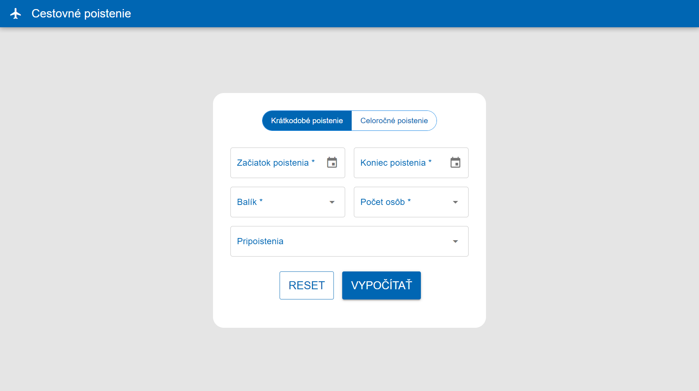

# Vue.js App (poistenie-vue)

<a href="https://lemonrick.github.io/poistenie-vue/" target="_blank">Live Demo</a>


```bash
yarn
# or
npm install
```

### Start the app in development mode (hot-code reloading, error reporting, etc.)
```bash
quasar dev
```

<p>

&nbsp;

&nbsp;

</p>
